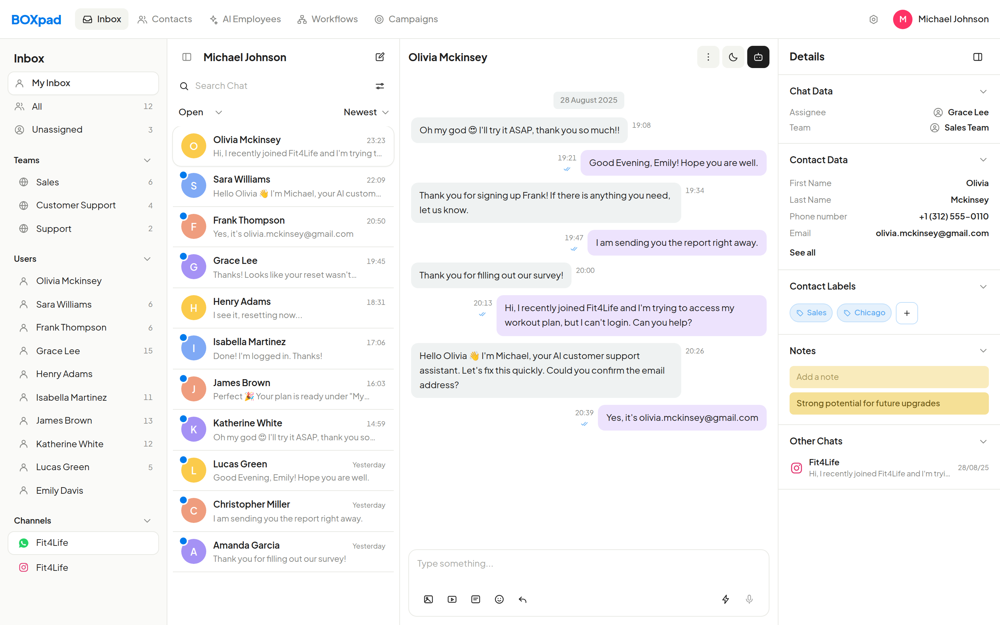
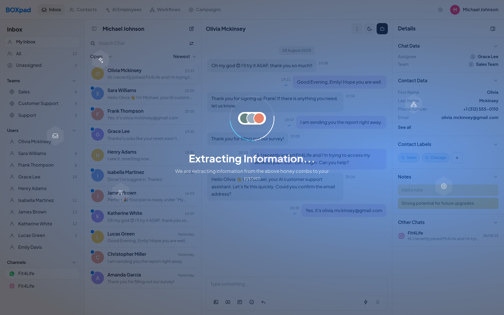
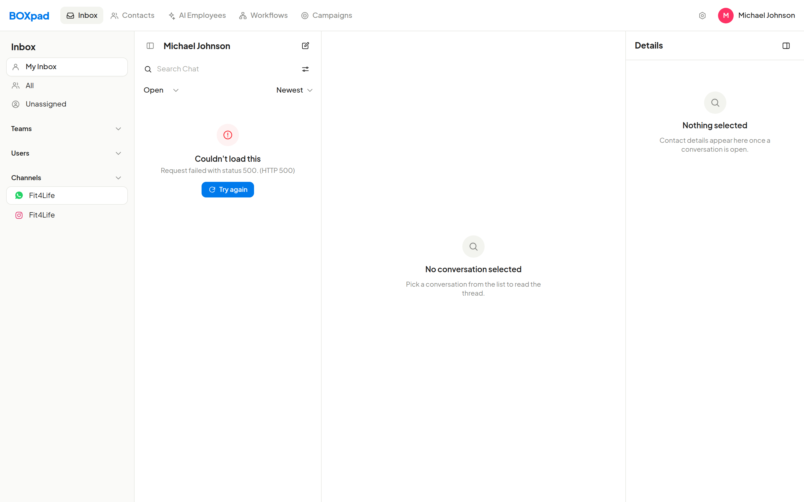
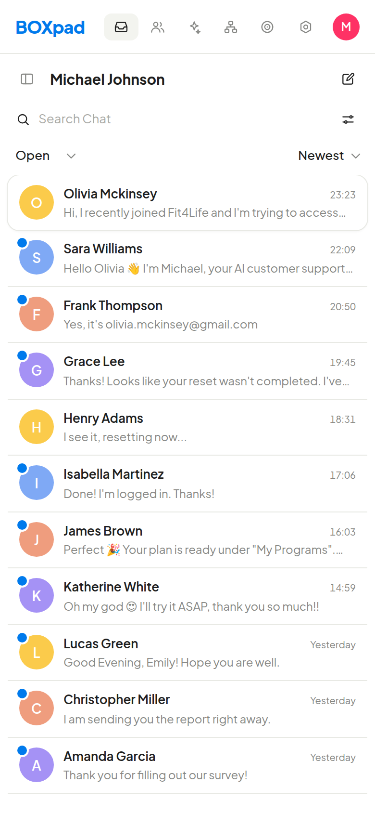
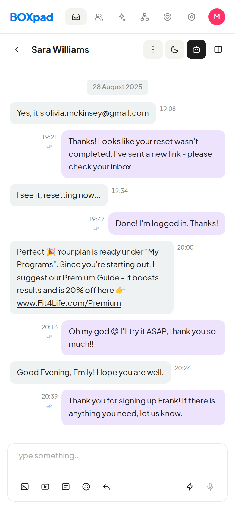

# BOXpad — Inbox Dashboard

A shared team inbox built for the Favlogix front-end screening assignment, implementing the
"Inbox Dashboard" and "Loading Skeleton" frames from the provided Figma file.

Next.js 16 (App Router) · TypeScript · Tailwind v4 · no other runtime dependencies.



---

## Setup

Requires **Node 20.9+**.

```bash
npm install
npm run dev          # http://localhost:3000
```

| Script | Does |
| --- | --- |
| `npm run build` / `start` | production build / serve it |
| `npm run typecheck` | `tsc --noEmit` |
| `npm run lint` | eslint |
| `npm run mock` | optional local API fixture on `:4100` |

No environment variables are needed — the app talks to live dummyjson by default.

---

## APIs used

Live public test API: **[dummyjson.com](https://dummyjson.com)**.

| Purpose | Request |
| --- | --- |
| Conversation list + contact records | `GET /users?limit=12&select=firstName,lastName,email,phone,image,company,address` |
| Message previews for the list | `GET /comments?limit=12` |
| Messages in a thread | `GET /comments?limit=8&skip={(conversationId * 7) % 292}` |

The first two run in parallel via `Promise.all` on mount. The thread request fires when the
selected conversation changes, and the previous one is aborted via `AbortController`.

Every call goes through one wrapper (`lib/api/client.ts`) that builds the URL, checks the status,
and folds four failure modes into a single `ApiError`: network failure, non-2xx status, unparseable
body, and — re-thrown rather than surfaced — `AbortError`, so a cancelled request never renders as
an error. Raw shapes live in `dto.ts` and are mapped to domain types in `mappers.ts`, so no
component touches an API shape directly.

**Optional fixture.** `npm run mock` serves the same response shapes with the exact copy from the
frames (Olivia Mckinsey, the Fit4Life thread) — useful for judging design parity, and what the
screenshots below were captured against. Behaviour is identical either way; only the text differs.

```bash
npm run mock                                                  # terminal 1
NEXT_PUBLIC_API_BASE_URL=http://localhost:4100 npm run dev    # terminal 2
```

---

## What's implemented

Four columns from the Figma frames — nav rail, conversation list, message thread, details panel —
under a top bar.

- Selecting a conversation loads its thread
- Search filters by name, email or preview; status filter (`Open / Closed / All`) and sort
  (`Newest / Oldest`)
- Rail scopes — My Inbox, All, Unassigned, per-team, per-user — with counts derived from loaded
  data, not hardcoded
- Composer sends into the thread; `Enter` sends, `Shift+Enter` newlines
- Notes, collapsible sections, "See all" contact expansion, URLs in messages render as links

**Loading** — the dark "Extracting Information…" frame over first load, with per-column skeletons
underneath. Full choreography in [Figma comment coverage](#figma-comment-coverage) below.

**Errors and empty states** — failures show the HTTP status inline with a working *Try again*;
no-results and no-selection have their own states.

**Responsive** — below `md` the app becomes a drill-down: the list fills the screen, tapping a row
opens the thread with a back button, and the rail and details panel become drawers.

**Accessibility** — semantic landmarks, labels on every icon-only button, `aria-expanded` /
`aria-busy` / `aria-current`, visible focus rings, and a `prefers-reduced-motion` guard that skips
the animation rather than hiding it.

<p>
  
  
</p>
<p>
  
  
</p>

---

## Figma comment coverage

The brief puts the task list in the Figma comments. All five concern the loading choreography, so
that is where most of the work went — `components/inbox/loading/`.

**#1 — "This outline will be slightly animated too"**
A dash segment travels the hexagon edge (`Honeycomb.tsx`, `dash-drift`), 3.6s idle → 1.4s armed.
Drawn as an SVG polygon, not a CSS `clip-path` — a clipped div has no edge to stroke.

**#2 — selected icon gets a gradient highlight and hover effect; the bottom content area shows a
loading state; once data is ready the icon flies to its section, fades into place, and that section
populates**

| Clause | Implementation |
| --- | --- |
| gradient highlight | linear-gradient stroke, armed fill, pulsing `hex-halo` |
| hover effect | `hover:scale-110`, fill to `white/10`, glyph to full white |
| bottom area shows loading | `ExtractingOverlay` masks out toward the bottom instead of covering flat, so the skeleton stays visible underneath |
| icon flies to its section | `FlightLayer` — `position: fixed`, transform-only, so no layout is touched mid-flight |
| fades seamlessly into place | opacity holds for most of the trip, then a 240ms fade timed to land exactly on arrival |
| section then populates | `useLoadSequence` flips `ready[id]` on arrival; `populate-in` reveals that column alone |

**#3 — "glowing blue lines … shine and be in a circular pattern animation"**
`OrbitField.tsx` — five concentric rings, each a conic gradient masked to a hairline band so one
bright arc travels a circular track. Directions alternate so the field doesn't read as a rigid wheel.

**#4 — "Have a GIF here"**
`ExtractionCore.tsx` accepts a `gifSrc` and renders it at the centre of the ring. No asset was
supplied with the file, so the default is the stacked-avatar card from the frame.

**#5 — "skeleton state first, then each section animates and populates as its icon fetches data"**
Each column holds its skeleton behind its own `ready` flag. Sections are staggered 300ms and
deliberately overlap — the next honeycomb lights up while the previous is still travelling — so the
hand-off reads as one motion rather than four.

---

## Project structure

```
src/
├── app/              layout, page, globals.css (design tokens + keyframes)
├── components/
│   ├── icons/        31 icons exported from the Figma file, plus fallbacks
│   ├── inbox/        one component per column
│   │   └── loading/  useLoadSequence · Honeycomb · FlightLayer · OrbitField · ExtractionCore
│   ├── layout/       TopBar, BrandMark
│   └── ui/           Avatar · Chip · Skeleton · IconButton · Select · StateViews …
├── hooks/            useAsync · useConversations · useMessages · useMediaQuery
├── lib/
│   ├── api/          client · dto · mappers · conversations
│   └── format.ts     date formatting + derived counts
└── types/            domain types
```

The rule it follows: **`components/ui` knows nothing about the API, `components/inbox` knows nothing
about `fetch`, and `lib/api` knows nothing about React.** Swapping the backend touches one folder.

---

## State management

Plain `useState` plus one `useAsync` hook. Two endpoints and a handful of filters don't justify a
query library — I'd add one for shared cache across routes or optimistic mutations. Two decisions
worth calling out:

- **`useAsync` stores its result against the key it was fetched for.** The usual `loading` boolean
  written from inside an effect leaves a render where new deps are in scope but stale data is still
  held — click conversation B, see A's messages flash. Keying the result removes that window:
  `loading` is derived during render. Retry works by folding an attempt counter into the same key,
  so it's the same code path as a normal fetch, not a special case.
- **Selection is derived, not synced.** When filters change, the selected row may fall out of the
  list. Rather than an effect that corrects it, the selection is computed during render — the
  explicit pick if still present, otherwise the first row. No cascading render.

`useMediaQuery` uses `useSyncExternalStore`, which handles SSR and concurrent-render tearing that a
hand-rolled `useState` + listener does not.

---

## Design

Tailwind v4, configured in CSS via `@theme` — no `tailwind.config.js`. Every colour, radius, shadow
and column width is a token declared once in `globals.css`; components reference tokens, never raw
hex.

**The 0.75 scale.** The dashboard frames export at 1200 wide from a 1600 design, so every Dev Mode
number divides by 0.75 to land on whole pixels — `11.23` → 15 radius, `39.30` → 52.4 top-bar height,
`0.7` → 1 border. The loading frame is the exception: 1440×869 at 1:1.

**Fidelity was measured, not eyeballed** — the rendered DOM was compared against the Figma node tree
via the REST API. Everything lands within **0.05** of the frame's own units.

Three deliberate deviations:

- **Font.** The file is set in SF Compact, which is Apple-licensed and can't be served on the web.
  Inter is the substitute, picked by measuring advance widths against the file's own text nodes
  (4.95 total error across the nav labels vs 7.98 for the next-best candidate). Self-hosted, so no
  external request and no layout shift.
- **Rail left edge.** The spec puts the top bar at `5.41` and the rail at `7.72`; a uniform gutter is
  used instead so the two align, which is what the frames show.
- **Interaction states.** Hover, focus and transitions have no counterpart in a static frame.

---

## Assumptions made

Layout, colour and type come from the Figma file via the REST API, so the guesswork below is limited
to behaviour the frames don't specify.

1. **Branding.** The file carries two wordmarks — "BOXpad" (blue) and "heyy" (pink) — with no
   indication of which is current. The canonical frame (`5:443`) says heyy; two older frames say
   BOXpad. Rather than guess, both are built and clicking the wordmark toggles between them
   (`BrandMark.tsx`); the default is set with `<BrandMark initial="…" />`.
2. **No chat API exists.** dummyjson has users, posts and comments but no conversations. Comments
   stand in for messages — even indexes the customer, odd the agent, reproducing the left/right
   split. A deterministic `skip` per conversation keeps each thread stable across reloads.
3. **No timestamps in the data.** Message times are derived from record ids and anchored to
   28 August 2025, the date in the Figma thread. Deriving rather than using `Date.now()` keeps the
   thread stable across reloads and avoids a hydration mismatch. "Now" is the newest message in the
   loaded set, so the newest day renders as clock times and the one before as "Yesterday".
4. **Derived fields.** Contact labels use `company.department` and `address.city`. Unread counts come
   from a hash of the user id. Assignee has no API equivalent, so it's another user from the same
   fetched set, chosen deterministically.
5. **Sending is local-only.** dummyjson has no chat resource; `/comments/add` exists but is simulated
   and doesn't persist. A sent message is appended optimistically and doesn't survive a reload. Same
   for notes and labels.
6. **Static chrome.** Top-bar tabs other than Inbox, the channel list, and the composer's attachment
   buttons are presentational — no behaviour was specified for them.

---

## Verification

`npm run typecheck`, `npm run lint` and `npm run build` all pass clean.

Behaviour was checked in a headless browser across desktop and mobile viewports: conversation
selection, search filtering, empty state, team filtering, sending a message, adding a note,
expanding the contact record, collapsing sections, the mobile drill-down and both drawers, and the
error state with the API host unreachable.

## What I'd do next

- Drop in the GIF asset for comment #4 — the prop is wired, only the file is missing
- Unit tests for `mappers.ts` and `format.ts`, plus a Playwright smoke test of the flows above
- Move `selectedId` into the route (`/inbox/[id]`) so conversations are linkable
- Virtualise the conversation list if it ever holds more than a few hundred rows

## Deployment

Not deployed. `npm run build` passes and there's no server-side dependency, so `vercel --prod` from
the repo root is all that's needed.
